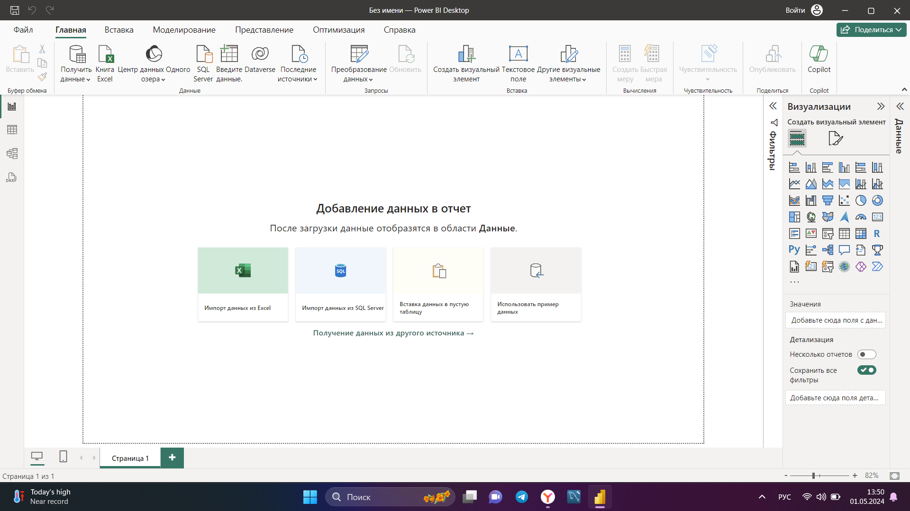

**Задание к семинару 1**  
1. Скриншот интерфейса power BI.  

2. Путь в аналитике:  
Опыта в аналитике нет. Решил сменить свою профессию, поэтому начал обучение на платформе и выбрал специализацию аналитик. В данный момент работаю врачом. В аналитике хотелось бы развиваться в направлении Data Science и связать это с медициной, так как сама профессия мне нравится, но оплата труда нет.  
Немного знаком с PowerBI, проходил буктемп по аналитике после завершения первого блока. Вел его Антон Смирнов, понравилась его подача материала и сама работа в PowerBI. 